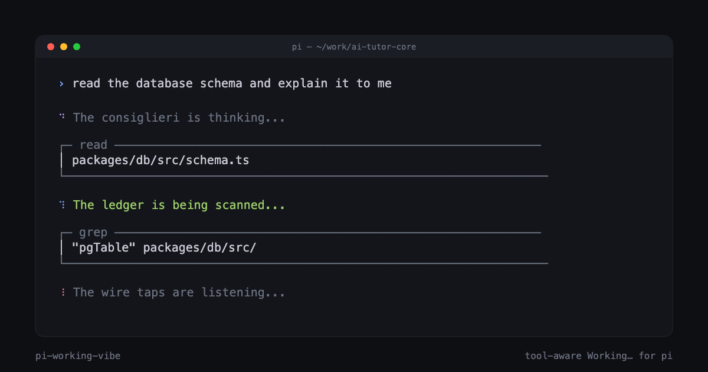

# pi-working-vibe

> Custom **Working…** message and tool-aware spinner for [pi](https://pi.dev).



Replace pi's default `⠋ Working…` with themed flavor text that rotates while
the agent is thinking, and automatically switches when the model calls a
tool. Ships with four ready-to-use vibes: **mafia**, **hacker**, **pirate**,
**zen**.

```
⠋ The Don is stirring...                        (default thinking)
⠙ The boys are kicking down doors...            (when calling bash)
⠹ The ledger is being scanned...                (when calling read)
⠸ The contract is being amended...              (when calling edit)
```

## Install

```bash
# From GitHub
pi install git:github.com/Davidcreador/pi-working-vibe

# Project-local (writes to .pi/settings.json)
pi install -l git:github.com/Davidcreador/pi-working-vibe

# Try without installing
pi -e git:github.com/Davidcreador/pi-working-vibe
```

That's it. Default vibe (`mafia`) activates immediately on the next session.

## What it does

- **Rotating message**: picks random lines from `vibes/<name>.txt` every ~3.5s
  while pi is in a turn.
- **Tool-aware**: switches to a tool-specific pool the instant the model
  invokes `bash`, `read`, `edit`, `grep`, `find`, `ls`, `write`, `web_search`,
  `web_fetch`, `todo`, or any custom tool you've authored a section for.
- **Customizable spinner**: swap the `⠋⠙⠹⠸` glyphs for one of six presets
  (`dots`, `line`, `pulse`, `braille`, `arrow`) or fully custom frames, with
  a themeable color.
- **Safe**: atomic settings writes, path-traversal guards, mtime-cached file
  IO, file-size caps, graceful degradation when a vibe pool is missing.

## Vibe file format

Vibes are plain text. One message per line. `#` for comments. Optional
`[section]` headers split lines into named pools:

```
# mafia.txt
The Don is stirring...
Shadows tally the books...

[tool:bash]
The boys are kicking down doors...
A package is being delivered...

[tool:read]
The ledger is being scanned...

[tool:edit]
The contract is being amended...
```

Pools fall back to `[default]` when the active tool doesn't have its own
section. A file with no headers becomes one big `default` pool (backward
compatible with any flat vibe file).

## Customize your own vibe

Drop a `.txt` file into `~/.pi/agent/vibes/` and switch to it:

```bash
# in pi
/vibe list                  # shows installed vibes (bundled + user)
/vibe vibe:hacker           # switch
/vibe info                  # current settings + line counts
/vibe pools                 # sections in the active vibe
/vibe preview               # show a sample line
```

User files in `~/.pi/agent/vibes/` override bundled files of the same name,
so you can fork `mafia.txt` without losing the package update.

## `/vibe` command reference

| Form | Effect |
|---|---|
| `/vibe` | Toggle master switch |
| `/vibe info` | Show active settings + line counts |
| `/vibe list` | List installed vibes (user + bundled) |
| `/vibe pools` | List sections in the active vibe |
| `/vibe on` \| `/vibe off` | Enable / disable |
| `/vibe reload` | Re-read settings + vibe file from disk |
| `/vibe preview` | Pick a sample line from the active pool |
| `/vibe vibe:<name>` | Switch active vibe |
| `/vibe indicator:<preset>` | `default` \| `dots` \| `line` \| `pulse` \| `braille` \| `arrow` \| `custom` |
| `/vibe color:<token>` | Theme color for spinner (e.g. `accent`, `primary`, `dim`) |
| `/vibe rotate:<ms>` | Message rotation interval (`0` = no rotation) |
| `/vibe interval:<ms>` | Spinner frame interval |

## Settings reference

All keys live at the top level of `settings.json`. Project file
`<cwd>/.pi/settings.json` overrides global `~/.pi/agent/settings.json`.

| Key | Type | Default | Effect |
|---|---|---|---|
| `workingVibe` | boolean | `true` | Master switch |
| `workingVibeName` | string | `"mafia"` | Vibe file name (no `.txt`) |
| `workingVibeRotateMs` | number | `3500` | Rotation interval; `0` = static. Floor 750ms |
| `workingIndicator` | enum | `"default"` | Spinner preset |
| `workingIndicatorColor` | string | `"accent"` | Theme color token |
| `workingIndicatorFrames` | string[] | `[]` | Custom frames (when `workingIndicator: "custom"`) |
| `workingIndicatorIntervalMs` | number | `90` | Spinner frame interval. Floor 40ms |

Legacy: a string value `workingVibe: "<name>"` from earlier ad-hoc usage is
auto-migrated to `{workingVibe: true, workingVibeName: "<name>"}` on first
load.

## Lifecycle (how it hooks into pi)

```
session_start         → load settings, install indicator, build picker
agent_start           → reset state, set message, start rotation timer
tool_call             → activePool=tool:<name>, refresh message
tool_execution_end    → if no more active tools, back to default
message_start (asst.) → snap to a fresh line as model resumes talking
agent_end             → stop rotation, reset state
session_shutdown      → tear down timer + null out ctx ref
```

Built on the [extension API](https://github.com/badlogic/pi-mono/blob/main/docs/extensions.md)
patterns: `setWorkingMessage`, `setWorkingIndicator`, and the `tool_call` /
`tool_execution_end` event pair.

## Authoring tips

- Pi only renders the working line during the streaming/tool phase. Compaction
  and retry loaders keep their own built-in styling — this is a pi constraint.
- Custom frames are rendered verbatim; colors come from pi's theme.
- Parallel tool calls: the most-recently-started tool wins. When that tool
  ends, the pool falls back to the next most-recent surviving tool, or to
  default if there are none.
- Edit a `.txt` file while pi is running — `mtime` caching auto-invalidates
  on the next read, or run `/vibe reload`.

## Bundled vibes

| File | Theme |
|---|---|
| `mafia.txt` | 1930s mob / made-men / consigliere |
| `hacker.txt` | 90s cyberpunk / phreakers / ICE |
| `pirate.txt` | High seas / treasure / plunder |
| `zen.txt` | Calm / contemplative / minimalist |

Each ships with ~110–140 lines across 11 sections (default + 10 tool pools).

## Contributing

PRs welcome — especially new vibe themes. Each vibe should cover the standard
tool taxonomy (`bash`, `read`, `edit`, `write`, `grep`, `find`, `ls`,
`web_search`, `web_fetch`, `todo`) plus a meaty `[default]` pool.

## License

MIT
